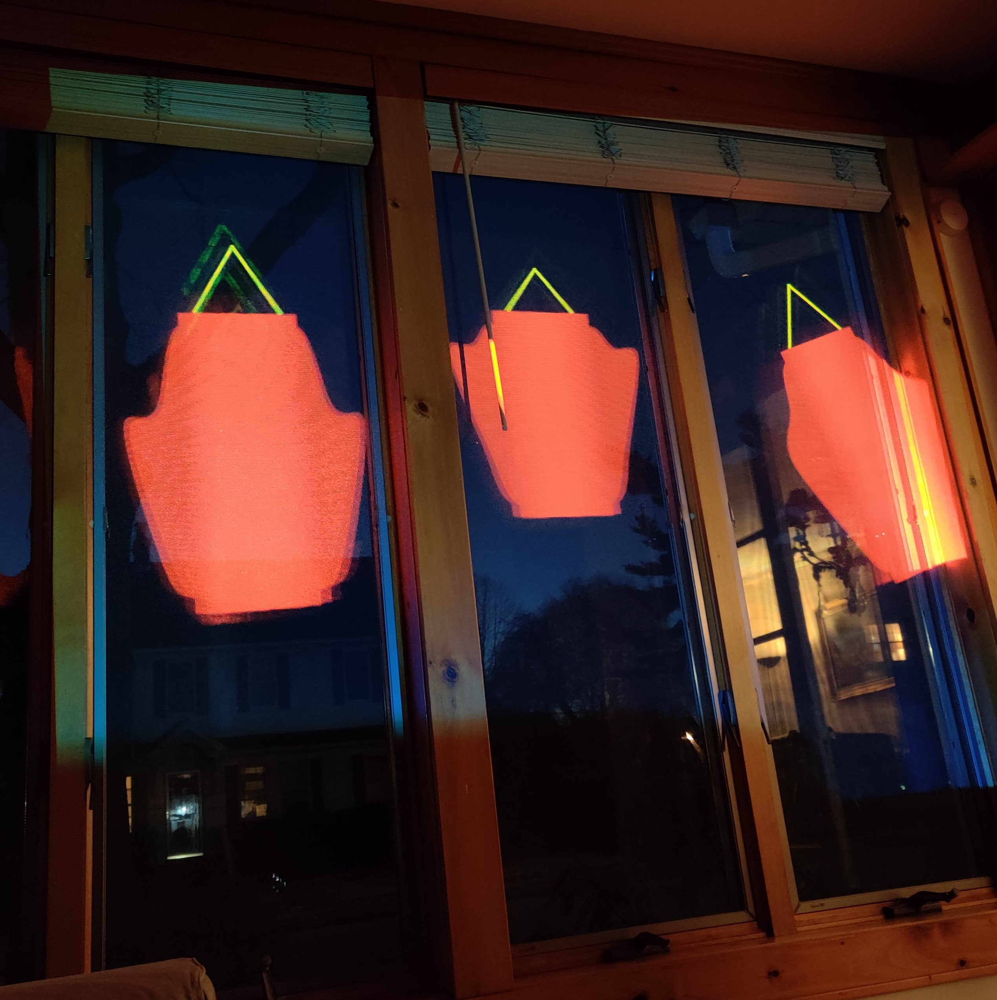

# Lantern Display <!-- omit in toc -->

Excited for Lunar New Year but don't have any decorations? Look no further! This program generates digital lanterns which can be projected directly onto your windows. The lanterns sway rhythmically and juxtapose their physical surroundings, bringing a modern spin to your traditional festivities. At the same time, a connected group of LEDs signals changes in the market, showing between one and four green or red lights to represent gains and losses.
    
[Video Demo](https://youtu.be/bRy3vwIOVYM)

## Background <!-- omit in toc -->
The Lunar New Year is a time of rest and celebration for people all around the world. In many parts of Asia, it is celebrated by an entire week off of work, providing adults with time to clean, cook, and spend time with family.

Yet, the world does not come to a halt. Admist all of the relaxing quality time with family and friends is the never-ending world of work. In the Americas, where a week of vacation isn't provided for such an occasion, families are forced to budget their time, upholding traditions while continuing to learn, study, and earn a living.

This installation aims to illustrate such an incongruity by placing an LED module alongside the lanterns which reflects changes in the market (specifically, Bitcoin). While the lanterns are generated in a mathematically random manner, the Bitcoin pricing is sourced directly from actual real-time data. However, as one observes the installation, they may realize that the randomness of the lanterns becomes a comfortable sight. The Bitcoin prices, however, appear to be completely unpredictable. With so much of the world out of our control, we must keep what truly matters in mind.

# Table of Contents <!-- omit in toc -->
- [Setup](#setup)
  - [Hardware](#hardware)
  - [Wiring](#wiring)
  - [Software Dependencies](#software-dependencies)
  - [Market API](#market-api)
  - [Running manually](#running-manually)
  - [Run on boot](#run-on-boot)
- [Customization](#customization)
  - [Adjusting the Lantern Display](#adjusting-the-lantern-display)
  - [Adjusting the Market Display](#adjusting-the-market-display)

# Setup
## Hardware
This display used a Raspberry Pi 4 with 4GB of RAM running Raspbian GNU/Linux 10 (buster). To mimic the output of the installation, set the Raspberry Pi 4's display resolution to 800x600 via the system settings. In this case, a projector was connected via micro-HDMI.

## Wiring
A FreeNove 8 RGB LED module was used. This could likely be replaced with any strip of 8 NeoPixels. Connect the LED module to the Raspberry Pi's GPIO as follows:
1. Connect module's 5V to Pi's 5V
2. Connect module's GND to Pi's GND
3. Connect module's Din to Pi's GPIO18 (if this pin does not work, [GPIOs 10, 12, and 21](https://learn.adafruit.com/neopixels-on-raspberry-pi/raspberry-pi-wiring) are also suitable)

The website [pinout.xyz](pinout.xyz) is a helpful reference for the Raspberry Pi's pinout.

## Software Dependencies
The following dependencies are used by the programs in this repository. It is possible that the programs will work with other versions, but it is ideal to maintain consistency with the tested environment.
- Python 3.7.3
    - rpi-ws281x 4.2.5
    - adafruit-circuitpython-neopixel 6.0.1
    - requests 2.21.0
    - adafruit_blinka 5.13.0
        - Note: reinstall this after installing the other libraries (`sudo python3 -m pip install --force-reinstall adafruit-blinka`)
- Processing 3.5.3
- Alpha Vantage API key
    - Can be obtained from [here](https://www.alphavantage.co/) for free

## Market API
1. Create a file called `secret.txt` in the `/StockLight` directory and paste your Alpha Vantage API key into it (see [Dependencies](#dependencies) for more info).

## Running manually
To start the lantern display, run `processing-java --sketch=LanternDisplay --run` from the root directory. If `processing-java` is not on your path, replace it within the command with the full path to `processing-java`.

To start the NeoPixel component of the display, change into the `/StockLight` directory and run `sudo python3 stock_light.py`. Note that `sudo` is necessary in order to allow the program to communicate with the NeoPixels.

Upon startup, the lights will shine yellow to indicate the device is waiting for an internet connection. Once connected, the lights will change to blue, indicating data collection is ongoing. A minute later, the LEDs should update to reflect the changing prices.

## Run on boot
`systemd` is required to configure your Raspberry Pi to run these programs upon startup.
To set up the programs to run on boot, copy the files in the `/services` directory to `/lib/systemd/system/`. For example, from within the `/services` directory, run

    sudo cp *.service /lib/systemd/system/
If necessary, modify the files `/services/lanterndisplay.service` and `/services/stocklight.service` with a text editor to contain the appropriate paths to `python3`, `processing-java`, and the **code files** from this repository.
Have your system recognize the services with the command:

    sudo systemctl daemon-reload
Then, enable the services as follows:

    sudo systemctl enable lanterndisplay.service
    sudo systemctl enable stocklight.service
Upon restarting (e.g., `sudo reboot`), the programs should run.

# Customization
## Adjusting the Lantern Display
Each lantern in the display is a self-contained object. Thus, the number and positioning of the lanterns can be easily changed. To do so, simply go to the section of `/LanternDisplay/LanternDisplay.pde` and follow the examples provided in the section labelled `CREATE AND MODIFY LANTERNS HERE`.

Note that the four parameters passed when creating a new lantern are the horizontal and vertical coordinates of the top-left corner of the lantern's enclosing frame followed by the width and height of the frame. Uncomment the section in `/LanternDisplay/Lantern.pde` labelled `VIEW ALIGNMENT FRAMES` to view these frame boundaries while the program is running.

A typical installation process involves first turning on the projector and pointing it at a set of windows. Then, the lanterns can be adjusted so their frames coincide with the outlines of each of the physical window frames. Then, comment the alignment frame section once again.

It is also important to note that the shape of each lantern is randomly determined. However, a random seed is set to enforce deterministic behavior of the installation. This seed can be modified or removed in `/LanternDisplay/Lantern.pde`.

## Adjusting the Market Display
Bitcoin was selected for this installation due to its mainstream recognition and 24/7 activity. However, the file `/StockLight/stock_light.py` can be modified to select a different currency. In addition, the script can be modified to track a stock market symbol instead by changing the request and price lines as follows:

    req = requests.get("https://www.alphavantage.co/query", {
        "function": "GLOBAL_QUOTE", "symbol": TICKER, "apikey": secret
    })

    price = response["Global Quote"]["05. price"]

within the `check_price` function. The ticker symbol should be specified in a global variable. For example: `TICKER="GME"`. Note however that at the time of writing, Alpha Vantage does not provide real-time data for many stock market assets.